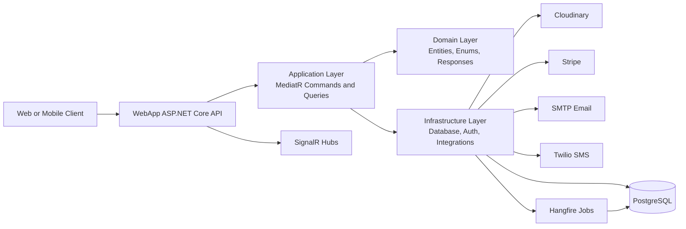

[README (1).md](https://github.com/user-attachments/files/32687325/README.1.md)
# TajMarket

A modular, multi-vendor e-commerce backend built with **ASP.NET Core Web API** and **.NET 9**. TajMarket provides APIs for customers, sellers, couriers, and administrators, including product management, shopping carts, orders, payments, delivery tracking, notifications, and reporting.

> **Project type:** Backend REST API  
> **Target framework:** .NET 9  
> **Database:** PostgreSQL  
> **API documentation:** Swagger / OpenAPI  
> **Default API route prefix:** `/api`

## Features

### Authentication and users

- User registration and login
- Email verification with OTP
- OTP resend and verification-attempt limits
- JWT access tokens and refresh tokens
- Logout with token revocation
- Password change
- Role-based authorization
- User profile update and avatar upload
- Admin user listing, blocking, and unblocking
- Automatic cleanup of unconfirmed users and expired/revoked tokens

### Marketplace

- Product creation, update, deletion, and listing
- Product variants, images, slugs, and categories
- Hierarchical category tree
- Seller registration and seller profiles
- Seller logo and product image uploads through Cloudinary
- Product filtering and pagination
- Product reviews and seller-rating recalculation
- Wishlist management
- Coupon creation, validation, activation, and usage tracking

### Cart, orders, delivery, and returns

- Add, update, remove, and clear cart items
- Order total calculation, including shipping and coupons
- Order creation and order-detail views
- Order status management
- Seller-specific order views
- Courier creation and management
- Manual and automatic courier assignment
- Courier status and location updates
- Courier map, history, and optimized route queries
- Delivery confirmation by code
- Return-request creation and administration
- Return approval, rejection, and completion

### Payments and communications

- Stripe PaymentIntent creation, confirmation, status lookup, and refunds
- Email OTP delivery through SMTP
- SMS delivery through Twilio
- Real-time notifications using SignalR
- Real-time courier updates using SignalR
- Background jobs and recurring tasks using Hangfire
- Structured console and per-service file logging using Serilog

### Administration and reporting

- Admin-only dashboard endpoints
- Dashboard summary
- Sales reports by period
- Top products
- Top sellers
- Protected Hangfire dashboard at `/hangfire`

## Architecture

The solution follows a layered architecture with feature-based application modules:



### Solution projects

| Project | Responsibility |
| --- | --- |
| `Domain` | Core entities, enums, filters, and shared response models |
| `Application` | Business use cases implemented with MediatR commands, queries, handlers, DTOs, and mappings |
| `Infrastructure` | Entity Framework Core, PostgreSQL, Identity, JWT services, Cloudinary, Stripe, Twilio, email, SignalR, and Hangfire |
| `WebApp` | ASP.NET Core host, controllers, Swagger, middleware configuration, dependency injection, migrations, and seed logic |

The application layer is organized by feature, including `Auth`, `User`, `Seller`, `Product`, `Category`, `Cart`, `Order`, `Payment`, `Courier`, `Review`, `Wishlist`, `Coupon`, `Notification`, `Address`, and `Dashboard`.

## Technology stack

- C# / .NET 9
- ASP.NET Core Web API
- Entity Framework Core 9
- PostgreSQL with Npgsql
- ASP.NET Core Identity
- JWT Bearer authentication
- MediatR 14
- Swagger / Swashbuckle
- Hangfire with PostgreSQL storage
- SignalR
- Serilog
- Stripe.NET
- CloudinaryDotNet
- Twilio

## Prerequisites

Install the following before running the project:

- [.NET 9 SDK](https://dotnet.microsoft.com/download/dotnet/9.0)
- PostgreSQL 14 or newer recommended
- A Cloudinary account for image storage
- A Stripe account for card payments
- An SMTP account for OTP email delivery
- A Twilio account if SMS delivery is enabled

## Getting started

### 1. Clone the repository

```bash
git clone https://github.com/magzumov06/TajMarket.git
cd TajMarket
```

### 2. Configure secrets

The repository contains configuration keys with empty values. Do not commit real credentials. Use **User Secrets**, environment variables, or a local configuration file.

The web project already has a User Secrets identifier. From the repository root, set the required values with:

```bash
dotnet user-secrets --project WebApp/WebApp.csproj set "ConnectionStrings:DefaultConnection" "Host=localhost;Port=5432;Database=tajmarket;Username=postgres;Password=your-password"
dotnet user-secrets --project WebApp/WebApp.csproj set "JwtSettings:Key" "replace-with-a-long-random-secret-key"
dotnet user-secrets --project WebApp/WebApp.csproj set "CloudinarySettings:CloudName" "your-cloudinary-cloud-name"
dotnet user-secrets --project WebApp/WebApp.csproj set "CloudinarySettings:ApiKey" "your-cloudinary-api-key"
dotnet user-secrets --project WebApp/WebApp.csproj set "CloudinarySettings:ApiSecret" "your-cloudinary-api-secret"
dotnet user-secrets --project WebApp/WebApp.csproj set "StripeSettings:SecretKey" "sk_test_your-stripe-secret-key"
dotnet user-secrets --project WebApp/WebApp.csproj set "StripeSettings:PublishableKey" "pk_test_your-stripe-publishable-key"
dotnet user-secrets --project WebApp/WebApp.csproj set "EmailSettings:Email" "your-smtp-email"
dotnet user-secrets --project WebApp/WebApp.csproj set "EmailSettings:Password" "your-smtp-password-or-app-password"
dotnet user-secrets --project WebApp/WebApp.csproj set "AdminSeed:Email" "admin@example.com"
dotnet user-secrets --project WebApp/WebApp.csproj set "AdminSeed:Password" "AdminPassword!123"
dotnet user-secrets --project WebApp/WebApp.csproj set "AdminSeed:PhoneNumber" "+992900000000"
dotnet user-secrets --project WebApp/WebApp.csproj set "HangfireDashboard:Username" "hangfire-admin"
dotnet user-secrets --project WebApp/WebApp.csproj set "HangfireDashboard:Password" "replace-with-a-strong-password"
dotnet user-secrets --project WebApp/WebApp.csproj set "SmsSettings:AccountSid" "your-twilio-account-sid"
dotnet user-secrets --project WebApp/WebApp.csproj set "SmsSettings:AuthToken" "your-twilio-auth-token"
dotnet user-secrets --project WebApp/WebApp.csproj set "SmsSettings:FromPhoneNumber" "+1xxxxxxxxxx"
```

The application also supports the following important settings:

- `JwtSettings:Issuer` — defaults to `TajMarket`
- `JwtSettings:Audience` — defaults to `TajMarketUsers`
- `JwtSettings:ExpiryMinutes` — defaults to `30`
- `JwtSettings:RefreshTokenExpiryDays` — defaults to `30`
- `EmailSettings:SmtpHost` — defaults to `smtp.gmail.com`
- `EmailSettings:SmtpPort` — defaults to `587`
- `ShippingSettings:*` — warehouse location and shipping-price calculation settings
- `SmsSettings:Provider` — defaults to `Twilio`

### 3. Create the PostgreSQL database

Create an empty PostgreSQL database matching the connection string:

```sql
CREATE DATABASE tajmarket;
```

On application startup, the host applies pending Entity Framework Core migrations and seeds the standard roles:

- `Admin`
- `Customer`
- `Seller`
- `Courier`

It also creates the configured admin account if that account does not already exist.

### 4. Restore, build, and run

```bash
dotnet restore TajMarket.sln
dotnet build TajMarket.sln
dotnet run --project WebApp/WebApp.csproj
```

The exact local URL is printed by ASP.NET Core when the application starts. The launch profile is located at `WebApp/Properties/launchSettings.json`.

### 5. Open Swagger

When the application runs in the `Development` environment, Swagger is enabled. Open the Swagger URL printed in the terminal, commonly one of:

```text
https://localhost:xxxx/swagger
http://localhost:xxxx/swagger
```

For protected endpoints, click **Authorize** in Swagger and provide:

```text
Bearer <your-jwt-access-token>
```

## API overview

All controllers inherit from `BaseApiController`, which uses the `api/[controller]` route convention. The main API areas are:

| Controller | Main responsibilities |
| --- | --- |
| `Auth` | Registration, login, logout, refresh token, password change |
| `Otp` | Email OTP verification and resend |
| `Users` | Profiles, avatars, user management, block/unblock |
| `Sellers` | Seller registration, profile, and store logo |
| `Product` | Product CRUD, image upload, filtering, seller products |
| `Category` | Category CRUD and category tree |
| `Cart` | Cart item management |
| `Wishlist` | Add, remove, and view wishlist items |
| `Order` | Checkout, order lifecycle, returns, delivery confirmation |
| `Payment` | Stripe payment processing and payment lookup |
| `Review` | Product reviews |
| `Coupon` | Coupon management and validation |
| `Couriers` | Courier management, assignment, locations, maps, and routes |
| `Notification` | User and broadcast notifications |
| `Dashboard` | Admin summary and sales analytics |

### SignalR hubs

The application exposes two real-time hubs:

| Hub | URL | Purpose |
| --- | --- | --- |
| Notification hub | `/hubs/notifications` | User and broadcast notifications |
| Courier hub | `/hubs/couriers` | Courier location and status updates |

JWT access tokens can be supplied to SignalR connections using the `access_token` query-string parameter. The configured CORS policy currently allows the local frontend origins `http://localhost:5173` and `http://192.168.123.35:5173`.

## Roles and authorization

The backend uses ASP.NET Core Identity roles and JWT claims:

- **Admin** — platform administration, user management, courier management, dashboard, and privileged operations
- **Customer** — shopping, cart, wishlist, orders, reviews, and profile operations
- **Seller** — seller profile, products, seller orders, and courier-related real-time access
- **Courier** — assigned orders, delivery status, location, route, and courier history

The API also defines the following authorization policies:

- `AdminOnly`
- `SellerOnly` — Seller or Admin
- `CourierOnly` — Courier or Admin

## Database model

The Entity Framework Core context includes entities for:

- Users, roles, seller profiles, and couriers
- Categories, products, product images, and product variants
- Carts and cart items
- Orders, order items, payments, and return requests
- Addresses and wishlists
- Reviews and notifications
- Coupons and OTP codes
- Refresh tokens and revoked tokens

The current repository includes an EF Core migration under `Infrastructure/Migrations`. If the data model changes, create a new migration from the `WebApp` project:

```bash
dotnet ef migrations add YourMigrationName \
  --project Infrastructure/Infrastructure.csproj \
  --startup-project WebApp/WebApp.csproj \
  --output-dir Migrations
```

Apply migrations manually when needed:

```bash
dotnet ef database update \
  --project Infrastructure/Infrastructure.csproj \
  --startup-project WebApp/WebApp.csproj
```

## Background jobs

Hangfire is configured with PostgreSQL storage and starts a background worker when the application starts. The application schedules recurring jobs for:

- Deleting old unconfirmed users
- Deleting expired revoked tokens

The dashboard is available at:

```text
/hangfire
```

It is protected by the username and password configured in `HangfireDashboard`.

## Logging

Serilog writes logs to the console and to service-specific files below:

```text
WebApp/Logs/<ServiceName>/log-<date>.txt
```

Logs and generated files are ignored by Git. For production deployments, use a centralized logging system and avoid storing sensitive request data in logs.

## Security notes

- Never commit database passwords, JWT keys, Stripe keys, Cloudinary secrets, SMTP passwords, or Twilio credentials.
- Use a long, randomly generated JWT signing key in every environment.
- Use Stripe test keys during development and configure webhooks before production payment processing.
- Change the seeded admin password immediately after the first deployment.
- Configure a production CORS allow-list instead of relying on local development origins.
- Protect `/swagger` and `/hangfire` appropriately in production.
- Configure HTTPS and secure secret storage in deployment environments.
- Review the Stripe `ReturnUrl` and currency settings before enabling production payments.

## Current project notes

- This repository contains the backend API; no separate frontend application is included in the solution.
- Automated tests are not currently included in the repository. Adding unit and integration tests is recommended before production use.
- The application expects PostgreSQL and external service credentials for its complete feature set.
- Development Swagger is enabled only when the ASP.NET Core environment is `Development`.

## License

No license file is currently included in the repository. Add a `LICENSE` file before publishing the project for public reuse, or clearly define the project’s private usage terms.

## Repository

[https://github.com/magzumov06/TajMarket](https://github.com/magzumov06/TajMarket)
